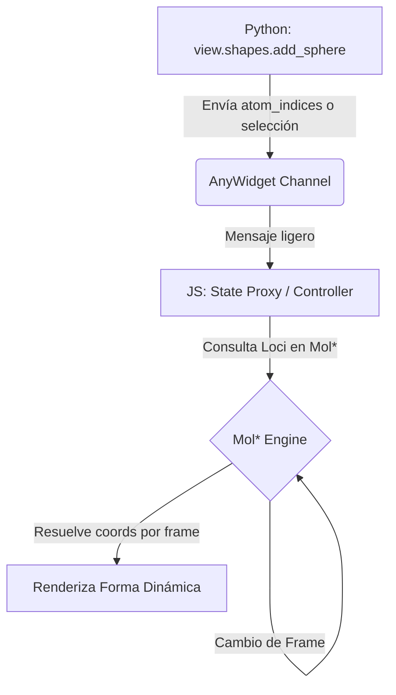

# Análisis Riguroso de Áreas de Oportunidad para MolSysViewer 1.0.0+

Este documento detalla el análisis de viabilidad, implicaciones técnicas, ventajas y desventajas de las cinco áreas de oportunidad identificadas para robustecer la librería de cara a su madurez científica, utilizando la terminología estándar de MolSysSuite.

---

## 1. Resolución Dinámica de Coordenadas en el Frontend (Shapes por Selección)

### Contexto Actual
Para agregar mallas o formas geométricas (esferas de farmacóforos, tubos de canales, etc.), la API de Python requiere arreglos de coordenadas físicas en 3D (`coordinate_arrays` en Angstroms). Esto obliga a que Python extraiga y envíe grandes volúmenes de flotantes por el canal de AnyWidget, lo cual puede generar cuellos de botella en redes de Jupyter lentas o con trayectorias de muchos frames.

### La Propuesta
Permitir que los métodos de `view.shapes` (ej. `add_sphere`, `add_channel_tube`) acepten argumentos lógicos de átomos (`selection` o `atom_indices`) en lugar de coordenadas 3D estáticas. El frontend (Mol*) resolvería dinámicamente las posiciones 3D de esos átomos (o sus centroides) para cada frame de la trayectoria activa.

### Análisis Técnico



*   **Ventajas (Pros)**:
    *   **Eficiencia de Red**: Reducción drástica del tamaño de los mensajes JSON. Un conjunto de índices de átomos o una cadena de selección ocupa bytes, en comparación con megabytes de coordenadas de trayectorias con miles de frames.
    *   **Fluidez en Animaciones**: La geometría se actualiza de manera nativa en el hilo de renderizado de la GPU del navegador, evitando latencias de ida y vuelta a Python durante la reproducción de trayectorias.
    *   **Simplicidad para el Científico**: Escribir `view.shapes.add_sphere(selection="group_name == 'TRP'")` es más intuitivo que realizar cálculos de centroides en Python antes de la visualización.
*   **Desventajas e Inconvenientes (Cons)**:
    *   **Complejena en el Frontend**: Requiere que los constructores de geometría en `js/src/shapes/` no asuman coordenadas estáticas, sino que mantengan referencias a los componentes moleculares subyacentes de Mol* y recalculen las mallas reactivamente ante cambios de frame.
    *   **Manejo de Errores Tardíos**: Si la selección de átomos se vuelve vacía en algún frame (por ejemplo, si el grupo sale del rango o no está cargado), el frontend debe manejar la degradación visual con gracia (ej. ocultar la forma temporalmente) sin colapsar el hilo de renderizado.
*   **Decisión Recomendada**: Altamente viable y recomendada como característica estrella para la versión 1.1.0. Se sugiere empezar con `add_sphere` y `add_links` (enlaces dinámicos), manteniendo los parámetros de coordenadas puras como alternativa de bajo nivel.

---

## 2. Modos de Coexistencia de Representaciones Globales

### Contexto Actual
El método `whole.set_representation(representation)` aplica un estilo visual a todo el sistema. Sin embargo, si un usuario aplica un estilo (ej. `Cartoon`) y luego otro (ej. `Sticks`), Mol* añade ambos estilos simultáneamente en lugar de realizar una transición o reemplazo limpio.

### La Propuesta
Introducir un parámetro de modo de aplicación en las representaciones globales: `whole.set_representation(..., mode="replace" | "additive" | "exclusive")`.

### Análisis Técnico
*   **Definición de Modos**:
    *   `replace`: Elimina todas las representaciones globales activas del visor antes de añadir la nueva. Garantiza un lienzo limpio.
    *   `additive`: Añade la representación como una nueva capa gráfica sobre las existentes (comportamiento actual).
    *   `exclusive`: Reemplaza únicamente las representaciones pertenecientes a la misma familia o categoría (ej. si se aplica `Ribbon`, se elimina `Cartoon`, pero se conservan los `Sticks` de ligandos si se definieron en otra capa de representación).
*   **Ventajas (Pros)**:
    *   Previene la superposición accidental de geometrías pesadas (como mallas tridimensionales de esferas sobre caricaturas de cintas), mejorando el rendimiento de renderizado en la GPU.
    *   Mejora la predictibilidad del visor para usuarios que interactúan mediante celdas de Jupyter sucesivas.
*   **Desventajas e Inconvenientes (Cons)**:
    *   Exige que `viewer-controller.ts` lleve un registro estricto e inmutable de cuáles representaciones dentro de Mol* se clasifican como "globales" (`globalReprs`) para poder filtrarlas y purgarlas de forma selectiva sin interferir con las representaciones que pertenecen a regiones específicas definidas por el usuario.
*   **Decisión Recomendada**: Es una mejora de bajo riesgo y alto impacto. Debe implementarse antes de la versión 1.0.0, estableciendo `mode="replace"` como el valor predeterminado para las operaciones sobre `whole`.

---

## 3. Cómputo Dinámico de Regiones Complementarias

### Contexto Actual
El método `new_complementary_region()` calcula el conjunto de átomos complementario en Python evaluando el estado del sistema en ese instante de tiempo. Si posteriormente se cargan nuevas estructuras, se eliminan cadenas o cambia la topología del visor, la región complementaria queda visualmente obsoleta porque representa un conjunto de átomos estático.

### La Propuesta
Mapear las regiones complementarias como expresiones lógicas dinámicas en lugar de arreglos estáticos de índices de átomos en Python.

### Análisis Técnico
*   **Opciones de Diseño**:
    *   **Opción A (Actualización desde Python)**: Python escucha eventos de cambio estructural en el visor y recalcula activamente los índices del complemento, enviando un mensaje de actualización de región.
        *   *Evaluación*: Sencillo de implementar, pero propenso a latencias de red y asincronía si hay cambios rápidos.
    *   **Opción B (Lógica en el Frontend)**: Registrar en el frontend de JavaScript que la región `R_comp` se define como la negación lógica de `R1` y `R2` (`not (R1 or R2)`). El frontend recalcula automáticamente los átomos del componente Mol* en cada actualización estructural.
        *   *Evaluación*: Rendimiento instantáneo (0 ms de latencia) y libre de tráfico de red. Sin embargo, la API interna de Mol* está muy orientada a selecciones basadas en listas de elementos estáticas, por lo que implementar lógica booleana dinámica a nivel de Loci requiere un acoplamiento profundo con las tripas del motor de renderizado.
*   **Decisión Recomendada**: Mantener la implementación actual basada en Python para la versión 1.0.0 debido a la complejidad de la Opción B. Documentar que las regiones complementarias son de naturaleza estática y evaluar la opción del cálculo dinámico en el frontend para futuras iteraciones de la arquitectura de Mol*.

---

## 4. Eventos de Interacción con Payloads Enriquecidos

### Contexto Actual
Cuando el usuario interactúa con el canvas (cruzando el cursor sobre un átomo o haciendo clic), el visor captura el elemento de Mol* y envía a Python un evento básico que contiene únicamente el índice de átomo físico (`atom_index`) y coordenadas de pantalla. Para mostrar información inteligible (ej. `"Grupo: Ala 43, Cadena: A"`), Python debe interceptar el evento y realizar búsquedas locales en la topología de MolSysMT, lo que añade latencia.

### La Propuesta
Que el normalizador de eventos en el frontend de JavaScript consulte la jerarquía molecular directamente dentro de la estructura cargada en Mol* y emita un payload de evento enriquecido alineado con el vocabulario de MolSysMT.

### Ejemplo de Payload Propuesto
```json
{
  "event": "hover",
  "atom_index": 1248,
  "metadata": {
    "chain_id": "A",
    "group_name": "ALA",
    "group_id": "43",
    "group_index": 42,
    "atom_name": "CA",
    "element": "C"
  },
  "coordinates": { "x": 420, "y": 300 }
}
```

### Análisis Técnico
*   **Ventajas (Pros)**:
    *   **Interactividad Instantánea**: Los paneles interactivos de los add-ons pueden reaccionar y actualizar gráficos o textos de información al instante sin necesidad de invocar al backend de Python a través de AnyWidget.
    *   **Menor Acoplamiento**: El add-on no requiere tener acceso o conocimiento directo de la estructura de datos de MolSysMT en Python para presentar información contextual básica al usuario.
*   **Desventajas e Inconvenientes (Cons)**:
    *   Incremento marginal del tamaño de los mensajes de red. Dado que la interacción del usuario es un evento discreto (un clic o hover a la vez), la diferencia de tamaño en bytes es insignificante y no afecta el rendimiento.
*   **Decisión Recomendada**: Excelente adición de alta prioridad. Dado que el frontend de JavaScript ya tiene acceso a los objetos `Loci` y `StructureElement.Location` de Mol* durante la normalización del evento, la extracción de estos campos jerárquicos es una operación de coste computacional casi nulo en el navegador. Es altamente recomendable su inclusión en la versión 1.0.0.

---

## 5. Eventos del Ciclo de Vida del Frontend para Add-ons (Bus de Eventos Local)

### Contexto Actual
El ciclo de vida de los add-ons se orquesta en Python. No obstante, ciertos add-ons altamente interactivos necesitan responder a eventos continuos del visor en tiempo real (como el cambio de frame en la reproducción de una trayectoria para actualizar una gráfica de distancias o energías en el panel lateral).

### La Propuesta
Dotar al proxy de estado del add-on (`model`) en el frontend de la capacidad de suscribirse a un bus de eventos local del visor de forma directa, eliminando el puente de red de Python para eventos de alta frecuencia.

### Ejemplo de Uso en Frontend
```js
// Dentro del render del add-on
export function render({ model, el }) {
    // Escucha directa de alta velocidad (latencia < 1ms)
    model.on("viewer:frame-changed", (frameIndex) => {
        updateTrajectoryPlot(frameIndex);
    });

    model.on("viewer:camera-moved", (cameraState) => {
        updateCameraCoordinatesDisplay(cameraState);
    });
}
```

### Análisis Técnico
*   **Ventajas (Pros)**:
    *   **Latencia Nula**: Permite experiencias de usuario de nivel profesional con gráficos fluidos a 60 FPS sincronizados con la trayectoria o el movimiento de la cámara en 3D.
    *   **Reducción de Carga en Python**: Evita inundar el hilo de ejecución de Python en Jupyter con cientos de eventos de movimiento de cámara o cambios de frame por segundo.
*   **Desventajas e Inconvenientes (Cons)**:
    *   Exige un diseño cuidado de la interfaz del bus de eventos para evitar exponer detalles internos y cambiantes de Mol* que puedan romper la compatibilidad de los add-ons en futuras actualizaciones del motor de renderizado.
*   **Decisión Recomendada**: Indispensable para add-ons dinámicos avanzados. Se propone definir un conjunto mínimo y estrictamente estable de eventos globales del visor (`"frame-changed"`, `"selection-changed"`, `"camera-moved"`) y exponerlos en el proxy `model` en `viewer-controller.ts`. Es una característica ideal para la versión 1.0.0.

---

## Resumen de Prioridades y Plan de Acción

A continuación se resume la propuesta de priorización de estas áreas de oportunidad para la discusión:

| Área de Oportunidad | Complejidad | Impacto | Versión Objetivo | Recomendación de Implementación |
| :--- | :---: | :---: | :---: | :--- |
| **Coexistencia de Estilos (`whole`)** | Baja | Medio | **1.0.0** | Implementar parámetro `mode="replace"` por defecto. |
| **Payloads de Interacción Enriquecidos** | Baja | Alto | **1.0.0** | Agregar metadatos de grupo/cadena en la normalización de Loci en JS. |
| **Eventos de Frontend para Add-ons** | Media | Alto | **1.0.0** | Exponer bus de eventos local en el proxy compatible con Backbone. |
| **Resolución Dinámica de Shapes** | Alta | Alto | **1.1.0** | Posponer para post-1.0.0 por complejidad en la re-generación de mallas en JS. |
| **Regiones Complementarias Dinámicas** | Alta | Medio | **1.1.0+** | Mantener cálculo estático en Python; evaluar viabilidad en JS a futuro. |

---

## Estado Final de Implementación (Versión 1.0.0)

Tras la deliberación sobre estas áreas de oportunidad, se ha concretado la implementación de tres de las características más críticas para robustecer la interactividad científica de MolSysViewer de cara al lanzamiento 1.0.0. A continuación se detalla su estado e implementación técnica:

### 1. Resolución Dinámica de Coordenadas en el Frontend (Shapes por Selección)
* **Estado**: **Implementado y verificado**.
* **Detalles Técnicos**:
  - En Python, `add_sphere` en `molsysviewer/shapes/spheres.py` ahora admite los argumentos lógicos `selection`, `atom_indices` y `structures_atom_indices`. El backend utiliza `molsysmt.select` para resolver las expresiones de selección en arreglos de índices enteros. Si la selección es dinámica y varía entre estructuras (trayectorias), se empaqueta automáticamente como `structures_atom_indices` (una lista de listas por frame).
  - En JavaScript (`js/src/shapes/index.ts` y `js/src/managers/handlers/shape-handlers.ts`), el visor de Mol* intercepta estas listas de índices. Durante la reproducción o cambio de frame (`renderTrajectoryFrame`), el frontend calcula el centroide reactivamente a partir de la conformación tridimensional activa del objeto cargado en Mol* (`unit.conformation.position`).
  - Se incluye un control robusto de errores que evita colapsos si los índices están fuera de rango debido a cambios dinámicos de topología.
* **Pruebas**: Se añadió la prueba unitaria de integración `test_add_sphere_selection_and_indices` en `tests/shapes/test_shapes.py` que convalida con éxito el comportamiento del backend y los payloads generados.

### 2. Modos de Coexistencia de Representaciones Globales
* **Estado**: **CORREGIDO 2026-08-06 — este apartado describía lo contrario de lo que hace el visor.**
* **Detalles Técnicos**: se decidió no implementar el parámetro `mode`, y eso sigue en pie: no hay API para elegir cómo se aplica una representación global. Lo que este apartado afirmaba de más era el comportamiento por defecto. **No es aditivo: es sucesión.** `whole.set_representation()` deja **una** representación global, siempre.

  El modelo de Python no puede siquiera expresar dos: `Whole._representation` y `Whole._preset` son de valor único. Y el runtime lo cumple por dos mecanismos según el estado de partida — con una representación en pie edita el nodo existente (`applyWholeRepresentationInPlace`, mecanismo A del Contrato S9); con varias construye la nueva y **después** retira las que no reutilizó, que es el mismo "sin hueco" del Contrato S9 un nivel más arriba.

  Fijado en `tests/e2e/scene-contracts.e2e.ts`, contando las celdas reales de Mol\*. La regla normativa vive ahora en [`scene_contracts.md`](scene_contracts.md); este documento es el registro de la decisión sobre el parámetro `mode`, no sobre la semántica.

  *Cómo llegó a decir lo contrario durante meses: nada lo fijaba. Un documento de diseño y un renderizador discreparon y ninguna prueba tenía voto. Estuvo a punto de costarnos reportar un falso defecto a Mol\* por creerle al documento.*

### 3. Eventos de Interacción con Payloads Enriquecidos
* **Estado**: **Implementado y verificado**.
* **Detalles Técnicos**:
  - Se modificó la normalización de eventos de interacción (hover, click, context menu) en `js/src/managers/viewer-controller.ts`.
  - Utilizando el helper interno `extractAtomMetadata`, el frontend consulta la jerarquía MMCIF y de Mol* (`StructureElement.Location`) de forma directa y de costo computacional despreciable.
  - El payload enviado a los add-ons y a Python ahora incluye metadatos biológicos completos y alineados estrictamente con el vocabulario estándar de MolSysSuite: `chain_id`, `group_name`, `group_id`, `group_index`, `atom_name`, `element`, `atom_index` y `atom_id` (evitando cualquier uso de términos heredados como "residue").

### 4. Eventos del Ciclo de Vida del Frontend para Add-ons (Bus de Eventos Local)
* **Estado**: **Implementado y verificado**.
* **Detalles Técnicos**:
  - Se dotó al proxy Backbone `model` en JavaScript con la capacidad de suscribirse directamente a un bus de eventos de alta frecuencia del visor local (`"viewer:frame-changed"`, `"viewer:selection-changed"`, y `"viewer:camera-moved"`).
  - El registro de escuchas locales (`addonListeners`) está completamente gestionado y encapsulado en el controlador.
  - Para evitar fugas de memoria y garantizar la estabilidad en entornos de Jupyter persistentes, el método `cleanupActivePanelWidget()` del frontend realiza una purga e inhabilitación incondicional de todas las suscripciones locales al desmontar el panel o cambiar de espacio de trabajo.
  - Esta arquitectura permite el desarrollo de widgets interactivos laterales (paneles con gráficas 2D reactivas, monitores de distancias, etc.) con latencia cero (< 1 ms), eliminando por completo el tráfico de red de alta frecuencia hacia Python.

---

> [!NOTE]
> Esta implementación dota a MolSysViewer 1.0.0 de capacidades de sincronización científica de alto nivel y rendimiento óptimo en Jupyter y entornos standalone, manteniendo la simplicidad de la API pública para el usuario final.

