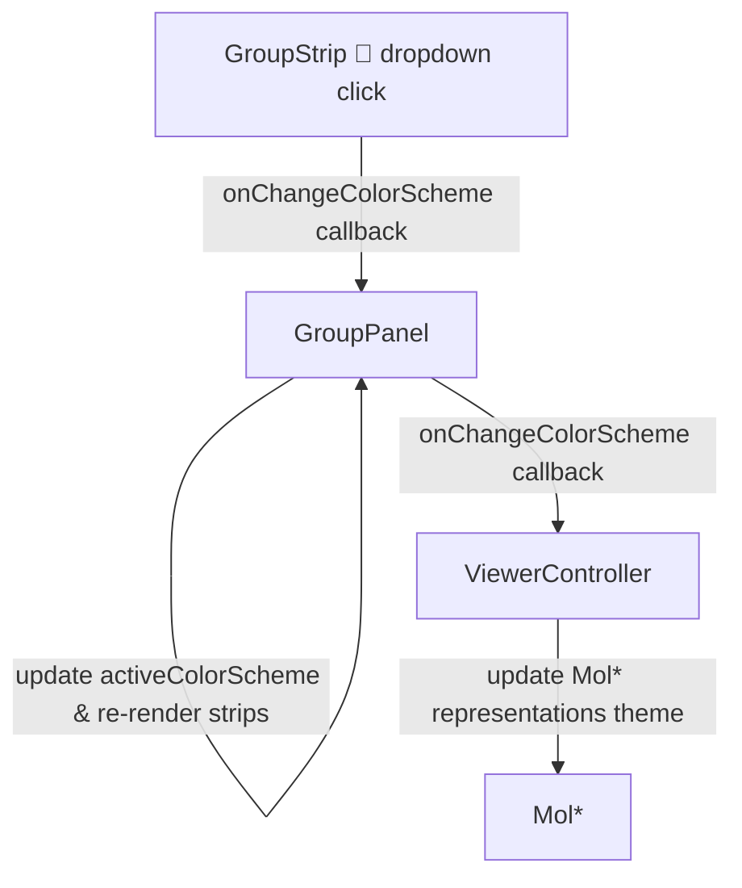

# Physicochemical Residue Coloring Plan (Issues #29 & #30)

This document outlines the design and implementation strategy for integrating residue-class physicochemical coloring in both the primary sequence view and the 3D molecular representation.

---

## 1. Why (Rationale)

### A. Scientific & Visualization Value
Interpreting a three-dimensional protein structure in terms of residue chemistry is fundamental to analyzing protein folding, binding interfaces, functional regions, and molecular interactions. By mapping physicochemical properties directly onto the sequence buttons and the 3D model:
* Users can instantly correlate sequence-level features with their 3D structural context.
* Chemically relevant regions (e.g., acidic clusters, basic patches, or hydrophobic cores) become immediately visible.

### B. User Interface Efficiency (Preserving Real Estate)
The `Navigate` sidebar panel has a narrow width constraint of 180px.
* Traditional dropdown selectors or inline option pill buttons would consume valuable vertical space or overflow horizontally.
* **The Hybrid Solution**: Adding a single, compact `🎨` button inline inside the "Structure" section header takes **zero vertical space**. Clicking it opens a floating menu popup that allows selecting between multiple color schemes (Neutral, Physicochemical Class, etc.), giving full user control and future extensibility.

### C. Unified State (Dynamic Priority Coloring)
Python methods like `view.whole.set_colors(...)` allow users to map custom scientific values (like charge, polarity, flexibility, or solvent accessibility) onto the 3D structure.
* This plan implements a **double-priority styling** in the sequence view: it automatically displays custom values (if sent from Python via `"set_atom_colors"`) or falls back to the default physicochemical color scheme.
* This ensures that any future properties from `molsysmt.physchem` will color both the sequence buttons and the 3D model in perfect sync.

---

## 2. What (Design Specification)

### A. The Classification and Color Scheme
Residues are classified into mutually exclusive groups to prevent ambiguous coloring. Colors are chosen to fit beautifully in the dark-themed UI:

| Residue Class | One-letter | Three-letter | Hex Color | Integer Color |
| :--- | :--- | :--- | :--- | :--- |
| **Aliphatic** | G, A, V, L, I, P | GLY, ALA, VAL, LEU, ILE, PRO | `#ef4444` | `0xef4444` |
| **Aromatic** | F, Y, W | PHE, TYR, TRP | `#10b981` | `0x10b981` |
| **Acidic** | D, E | ASP, GLU | `#f59e0b` | `0xf59e0b` |
| **Basic** | K, R, H | LYS, ARG, HIS | `#0ea5e9` | `0x0ea5e9` |
| **Hydroxylic** | S, T | SER, THR | `#ec4899` | `0xec4899` |
| **Sulfur-containing** | C, M | CYS, MET | `#eab308` | `0xeab308` |
| **Amidic** | N, Q | ASN, GLN | `#2563eb` | `0x2563eb` |

*Unknown or non-standard residues default to a neutral gray (`#aaaaaa`).*

### B. UI Mockup and Behavior
1. In the "Structure" section header in the `Navigate` panel, a small paint-palette icon `🎨` is displayed inline.
2. Clicking it opens a floating dropdown menu containing:
   * **Neutral**: Buttons use the default gray theme (`rgba(255,255,255,0.06)`).
   * **Physicochemical Class**: Buttons are colored by their physicochemical properties (low opacity for unselected, higher opacity when selected).
3. Selecting a scheme from the menu updates:
   * The styling of sequence buttons inside the sidebar.
   * The 3D color theme representation inside Mol* (applying CPK/Element theme for Neutral, or the custom `msv-physicochemical` theme).

---

## 3. How (Implementation Details)

### A. Frontend (TypeScript)

#### 1. Define Mappings & Custom Mol* Theme
We will create a new file: `molsysviewer/js/src/themes/physicochemical-color.ts`.
* It defines and exports the classification tables: `ResidueToClass` (a dictionary of 1-letter and 3-letter codes to class name), `PhysicochemicalColorsHex` (for CSS), and `PhysicochemicalColorsInt` (for Mol* `Color`).
* It implements the Mol* `ColorTheme` factory named `MsvPhysicochemicalColorTheme` using the Mol* context, resolving atom names via `label_comp_id` in atomic units, and coarse sequence names in coarse units.
* It exports the provider `MsvPhysicochemicalColorThemeProvider` with category `Residue`.

#### 2. Event Flow & Callback Routing
Since the UI component (`GroupStrip`) has no direct reference to the Mol* plugin, the color scheme changes will be propagated to the controller via callbacks:



* **`GroupStrip` Updates**:
  * Constructor receives a callback `private readonly onChangeColorScheme?: (scheme: "neutral" | "physicochemical") => void`.
  * Renders an inline button `🎨` in the section header of its chain group. 
    * To ensure robust E2E testing, this button must have the attribute `data-molsysviewer-color-scheme-toggle="true"`.
  * When clicked, it renders a small absolute-positioned container overlay:
    ```typescript
    // Dropdown container style mockup
    const dropdown = document.createElement("div");
    dropdown.setAttribute("data-molsysviewer-color-scheme-menu", "true");
    Object.assign(dropdown.style, {
        position: "absolute",
        top: "22px",
        right: "0",
        background: "#18181b",
        border: "1px solid #3f3f46",
        borderRadius: "4px",
        zIndex: "10",
        padding: "4px 0",
        boxShadow: "0 4px 6px -1px rgba(0,0,0,0.5)"
    });
    ```
  * Inside the dropdown, it places buttons for "Neutral" and "Physicochemical Class" with attributes:
    * `data-molsysviewer-color-scheme-option="neutral"`
    * `data-molsysviewer-color-scheme-option="physicochemical"`
  * Clicking an option fires `onChangeColorScheme?.(scheme)` and removes the dropdown.
  * To handle closing the menu when clicking outside of it, a listener should be attached to `window`:
    ```typescript
    const onOutsideClick = (e: MouseEvent) => {
        if (!dropdown.contains(e.target as Node) && e.target !== button) {
            dropdown.remove();
            window.removeEventListener("click", onOutsideClick);
        }
    };
    // Defer register slightly to avoid catching the current toggle click event
    setTimeout(() => window.addEventListener("click", onOutsideClick), 0);
    ```
  * In its residue loop, it looks up the color:
    ```typescript
    const firstAtomIndex = item.atom_indices[0];
    const customColorInt = firstAtomIndex !== undefined ? getPerAtomColor(firstAtomIndex) : undefined;
    let colorHex: string | null = null;
    if (customColorInt !== undefined) {
        colorHex = "#" + customColorInt.toString(16).padStart(6, "0");
    } else if (activeColorScheme === "physicochemical") {
        const groupNameUpper = (item.group_name ?? "").toUpperCase();
        const residueClass = ResidueToClass[groupNameUpper];
        if (residueClass) colorHex = PhysicochemicalColorsHex[residueClass];
    }
    ```

* **`GroupPanel` Updates**:
  * Receives `onChangeColorScheme` in its constructor and stores it.
  * Stores the active state locally: `private activeColorScheme: "neutral" | "physicochemical" = "neutral"`.
  * Passes both `this.activeColorScheme` and a forward callback `(scheme) => { this.activeColorScheme = scheme; this.render(); onChangeColorScheme?.(scheme); }` to every `GroupStrip` instantiated during its `render()`.
  * Exposes `public render(): void` (changing the visibility from `private`) so the controller can trigger updates.

* **`ViewerController` Updates**:
  * Passes a callback to the `GroupPanel` instantiation (around line 907):
    ```typescript
    async (scheme) => {
        const themeName = scheme === "physicochemical" ? "msv-physicochemical" : "element-symbol";
        const components = this.state.getComponents();
        await this.plugin.managers.structure.component.updateRepresentationsTheme(components, {
            color: themeName as any
        });
    }
    ```
  * Register `MsvPhysicochemicalColorThemeProvider` after plugin init in `viewer-controller.ts`.
  * In the message handler switch block (`handleMessage`):
    ```typescript
    case "set_atom_colors":
        await this.state.setAtomColors(msg as any);
        this.groupPanel.render();
        break;
    case "clear_atom_colors":
        await this.state.clearAtomColors(msg as any);
        this.groupPanel.render();
        break;
    ```

* **`state-handlers.ts` Updates**:
  * In `getStructuralColorThemeFromParams()`, maps `physicochemical` to `"msv-physicochemical"`.

---

### B. Backend (Python)

1. **`molsysviewer/styles.py`**:
   * Exposes `"physicochemical"` in the public `STRUCTURAL_COLOR_SCHEMES` catalog:
     ```python
     "physicochemical": {
         "molstar_theme": "msv-physicochemical",
         "description": "Color by residue physicochemical properties.",
     }
     ```
   * Exposes `"msv-physicochemical"` in the advanced `ADVANCED_MOLSTAR_COLOR_THEMES` catalog:
     ```python
     "msv-physicochemical": {"category": "residue"}
     ```
   * Registers a default preset Style `"physicochemical"` in `BUILTIN_SCENE_STYLES`:
     ```python
     "physicochemical": Style(
         representation="cartoon",
         name="Physicochemical",
         params={"color_scheme": "physicochemical"},
     )
     ```

2. **`tests/test_styles.py`**:
   * Adds `"physicochemical"` to the list assertion for `structural_color_schemes()`.

