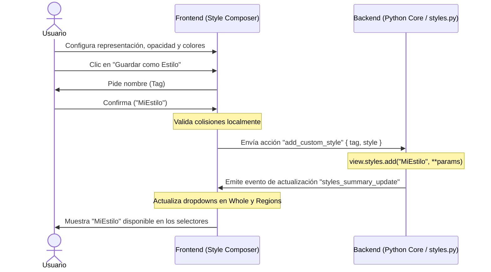

# Proposal: Custom Styles and Presets in the Studio GUI

**Status:** proposed (2026-07-10)
**Scope:** Shared Style Composer (`Whole` and `Regions` subpanels)

---

## 1. ¿Qué es? (What)

Esta propuesta describe la funcionalidad que permite a los usuarios de la interfaz gráfica (GUI) —que no interactúan directamente con la API de Python— **definir, guardar, catalogar y eliminar sus propios estilos o presets de representación visual**. 

En lugar de crear un subpanel redundante de "Estilos" en la barra lateral, esta capacidad se integra directamente dentro del **Style Composer compartido** que consumen tanto el subpanel **Whole** (para estilos globales) como el subpanel **Regions** (para estilos enfocados en selecciones de átomos).

### Características clave en la GUI:
1. **Botón de Guardado**: Un control visual en el Style Composer para capturar la combinación activa de representación, parámetros (opacidad, calidad) y colores.
2. **Entrada de Nombre (Tag) con Validación**: Un campo interactivo inline para asignar un nombre descriptivo al estilo (ej. `Publicacion_Premium`), con validaciones de nombre duplicado.
3. **Dropdown Organizado**: El selector de presets/estilos clasificará las opciones dinámicamente en dos categorías:
   * *Built-in Presets* (Estilos de fábrica).
   * *Custom Presets* (Estilos creados por el usuario).
4. **Acción de Eliminación**: Posibilidad de borrar estilos creados anteriormente mediante un botón de eliminación en la interfaz.
5. **Persistencia Total**: Los estilos guardados se registran en el backend de Python, de modo que se guardan y restauran al exportar/importar el estado de la sesión (`export_state` / `import_state`).
6. **Sincronía Cruzada**: Guardar o eliminar un estilo en un subpanel (ej. *Whole*) actualiza de inmediato los dropdowns del otro (ej. *Regions*).

---

## 2. ¿Por qué se necesita? (Why)

### 2.1 Cierre de brecha entre la GUI y la API de Python
Actualmente, un programador de Python puede definir plantillas de visualización personalizadas mediante `view.styles.add(tag, ...)` y aplicarlas con `view.styles.apply(tag)`. Sin embargo, un usuario de la interfaz gráfica/widget no tiene una forma equivalente de empaquetar una combinación compleja de representación, color y opacidad bajo un nombre reutilizable; tiene que volver a configurar todos los selectores manualmente para cada región nueva.

### 2.2 Evitar la fragmentación y redundancia de la interfaz
Una pestaña dedicada a "Estilos" competiría visual y mentalmente con las pestañas de **Whole** y **Regions**. Al integrar la creación y selección de presets dentro de la propia acción de estilizar, el flujo de trabajo permanece unificado. El usuario no tiene que saltar de pestaña para guardar o aplicar un estilo.

### 2.3 Colaboración y Reproducibilidad
Al guardar el estilo personalizado en el registro central de Python (`view.styles`), este se integra en el Contrato C de serialización. Si un usuario de la GUI exporta la sesión y se la envía a otro investigador, el destinatario verá los estilos personalizados en sus dropdowns y podrá usarlos también por código (`view.styles.apply("NombreEstilo")`).

---

## 3. ¿Cómo se implementa? (How)

La implementación sigue el flujo unificado entre la interfaz de TypeScript y el motor de Python:



### 3.1 Interfaz de Usuario (TypeScript)
En el componente compartido **Style Composer** (a extraer en la Fase 3 del plan de `Whole`):
* Se añade un botón al lado de "Apply" con el icono de un marcador/disco (`data-molsysviewer-save-style="true"`).
* Al hacer clic, se oculta temporalmente la fila de botones principal y se muestra un input de texto con confirmación (`Check` / `Cancel`) para ingresar el nombre.
* Tras confirmar, el componente emite la acción a través del canal de comunicación del panel.

### 3.2 Protocolo de Acción (Acción y Payload)
Se definen dos nuevas acciones en la unión de mensajes:

```typescript
interface AddCustomStyleAction {
    op: "add_custom_style";
    tag: string;
    style: {
        representation?: string;
        preset?: string;
        params: Record<string, any>;
    };
}

interface RemoveCustomStyleAction {
    op: "remove_custom_style";
    tag: string;
}
```

### 3.3 Backend de Python (`molsysviewer/viewer/core.py` y `styles.py`)
1. **Manejadores de Acción**:
   * Para `add_custom_style`, el handler en `core.py` digiere los parámetros y ejecuta:
     ```python
     self.styles.add(tag, representation=repr_type, preset=preset_type, **params)
     ```
   * Para `remove_custom_style`, ejecuta:
     ```python
     self.styles.clear(tag)
     ```
2. **Difusión del Catálogo**:
   * Tras cualquier modificación, el backend emite un mensaje de actualización de resumen de estilos (`styles_summary_update`) que incluye la lista completa de tags y detalles de los estilos personalizados disponibles.

### 3.4 Actualización en Caliente de la Interfaz
Al recibir el mensaje `styles_summary_update`, el componente de TypeScript:
1. Reconstruye las opciones del selector de presets del Style Composer.
2. Renderiza un elemento `<optgroup label="Custom Presets">` con los nombres personalizados.

### 3.5 Serialización (Contrato C)
El exportador del estado de la sesión (`viewer/state.py` / `export_state`) se actualiza para incluir el diccionario de estilos personalizados de `view.styles._registry` en el archivo de estado de la sesión, asegurando la persistencia a largo plazo.

### 3.6 Reglas de Validación y Colisiones (Diseño UX)
* **Nombres Prohibidos**: Si el usuario escribe el nombre de un estilo built-in (ej. `polymer-cartoon` o `hydrophobicity`), la confirmación se bloquea y se muestra un mensaje de error: *"No se pueden sobrescribir estilos de fábrica"*.
* **Confirmación de Sobrescritura**: Si el usuario introduce un tag que ya existe en sus estilos personalizados (ej. un `MiEstilo` previo), la interfaz solicita una confirmación: *¿Deseas reemplazar el estilo existente "MiEstilo"?* de manera inline. Si acepta, se realiza la llamada normal y se sobrescribe en Python.

### 3.7 Eliminación de Estilos desde la Interfaz
* Dado que los dropdowns nativos `<select>` no permiten botones internos de forma cómoda, la eliminación de estilos personalizados se implementa mediante un botón secundario de "Borrar Estilo Activo" (`data-molsysviewer-delete-style="true"`). 
* Este botón aparece únicamente al seleccionar un estilo dentro del grupo *Custom Presets*. Al hacer clic en él, se emite `remove_custom_style { tag }` al backend, eliminándolo del registro central.

### 3.8 Reactividad Cruzada (Sincronía)
Dado que tanto el panel de `Whole` como el de `Regions` se instancian en la misma sesión y comparten el `styles_summary_update`, cualquier cambio provocado desde cualquiera de los subpaneles se refleja inmediatamente en el selector de ambos. Esto asegura una experiencia coherente sin desfases temporales.
