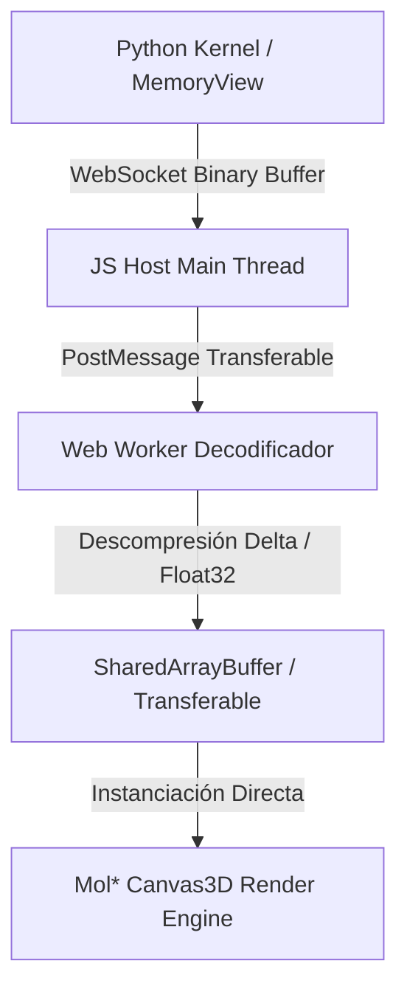
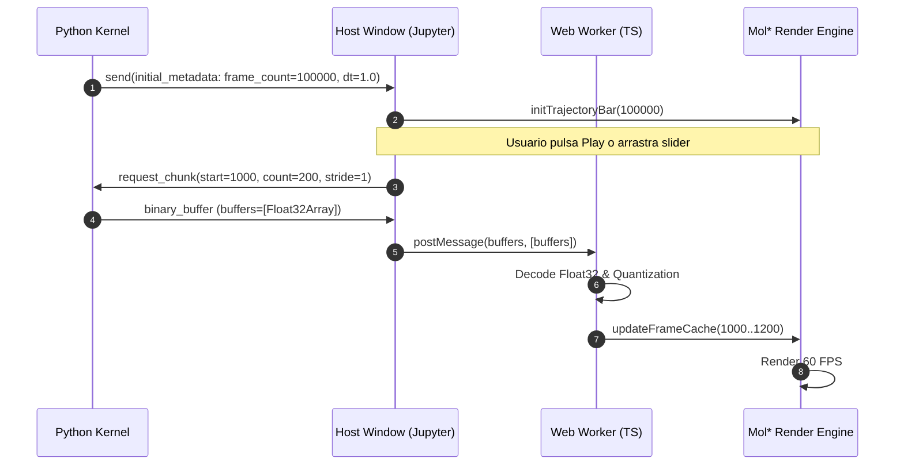
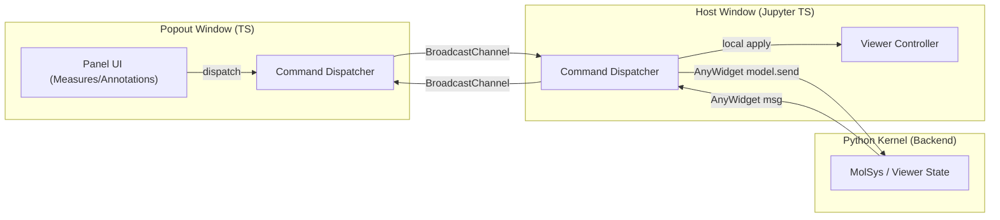

# Propuesta: Streaming de Trayectorias Masivas y Simplificación del Bus de Eventos Tripartito

**Estado:** Propuesta de Arquitectura (2026-07-27)  
**Módulo:** `molsysviewer/js/src/` y `molsysviewer/viewer/`  
**Objetivo:** Escalabilidad de rendimiento de trayectorias (100,000+ frames) y robustez del bus de eventos tripartito (Python ↔ Host ↔ Popout).

---

## Tabla de Contenido

1. [Resumen Ejecutivo](#1-resumen-ejecutivo)
2. [Propuesta 1: Streaming de Trayectorias Masivas ($10^5+$ frames)](#2-propuesta-1-streaming-de-trayectorias-masivas-105-frames)
   * [2.1 Diagnóstico de Cuellos de Botella](#21-diagnóstico-de-cuellos-de-botella)
   * [2.2 Transferencia Binaria Directa (`ArrayBuffer` / TypedArrays)](#22-transferencia-binaria-directa-arraybuffer--typedarrays)
   * [2.3 Ventana Dinámica (*Lazy Chunking & Adaptive Striding*)](#23-ventana-dinámica-lazy-chunking--adaptive-striding)
   * [2.4 Compresión Espaciotemporal (BinaryCIF Quantization)](#24-compresión-espaciotemporal-binarycif-quantization)
   * [2.5 Offloading a Web Workers](#25-offloading-a-web-workers)
   * [2.6 Diagrama de Flujo de Trayectoria](#26-diagrama-de-flujo-de-trayectoria)
3. [Propuesta 2: Bus de Eventos Tripartito Unificado (Python ↔ Host ↔ Popout)](#3-propuesta-2-bus-de-eventos-tripartito-unificado-python--host--popout)
   * [3.1 Diagnóstico de Fragilidad Arquitectónica](#31-diagnóstico-de-fragilidad-arquitectónica)
   * [3.2 Despachador Unificado (`ViewerCommandDispatcher`)](#32-despachador-unificado-viewercommanddispatcher)
   * [3.3 Transmisión Multicast Nativa (`BroadcastChannel API`)](#33-transmisión-multicast-nativa-broadcastchannel-api)
   * [3.4 Sincronización Declarativa de Deltas de Estado](#34-sincronización-declarativa-de-deltas-de-estado)
   * [3.5 Diagrama de Flujo del Bus de Eventos](#35-diagrama-de-flujo-del-bus-de-eventos)
4. [Matriz Comparativa de Rendimiento y Benchmark Esperado](#4-matriz-comparativa-de-rendimiento-y-benchmark-esperado)
5. [Plan de Implementación por Fases](#5-plan-de-implementación-por-fases)

---

## 1. Resumen Ejecutivo

Con el crecimiento de **MolSysViewer** como herramienta central del laboratorio y la suite **MolSysMT**, han emergido dos áreas clave de arquitectura que requieren evolución estructural para soportar cargas de trabajo de escala industrial:

1. **Transporte de Trayectorias de Gran Escala:** La conversión y envío de coordenadas como objetos JSON sobre el WebSocket de Jupyter/AnyWidget degrada el rendimiento a partir de ciertos umbrales de frames. Se propone la transición a **Buffers Binarios Nativos (`Float32Array`)**, **Lazy Streaming Adaptativo** y **Web Workers**.
2. **Bus de Eventos Tripartito:** La gestión de tres contextos desincronizados (Kernel Python, Ventana Host Jupyter y Ventana Popout) mediante canales mixtos (`model.send` y `window.postMessage`) incrementa la fragilidad. Se propone un **`ViewerCommandDispatcher`**, **`BroadcastChannel` API nativo** y **Deltas Declarativas de Estado**.

---

## 2. Propuesta 1: Streaming de Trayectorias Masivas ($10^5+$ frames)

### 2.1 Diagnóstico de Cuellos de Botella

Actualmente, cuando se carga una trayectoria en MolSysViewer:

* **Overhead de Serialización Stringify en Python:** Convertir arreglos de NumPy de floats a listas JSON de cadenas `[[x,y,z], ...]` requiere recorridos recursivos y asignaciones de memoria excesivas en el intérprete de Python.
* **Inflación de Ancho de Banda en WebSocket:** Las representaciones en texto de números flotantes (ej. `12.3456789`) consumen 3–4× más bytes por coordenada que su representación binaria pura de 32 bits (4 bytes).
* **Bloqueo del Main Thread en Navegador:** `JSON.parse()` e hidratación de objetos JavaScript se ejecutan en el hilo principal de renderizado WebGL2 de Mol*, produciendo congelamientos de la interfaz (*UI freezes*) durante la reproducción o scrubbing.

---

### 2.2 Transferencia Binaria Directa (`ArrayBuffer` / TypedArrays)

AnyWidget soporta el envío de buffers binarios contiguos directamente sin pasar por serialización JSON.

#### Código Python (Emisión de Buffer):
```python
# En Python (History / Controller):
coords_float32 = numpy_array.astype(np.float32)
binary_buffer = memoryview(coords_float32.tobytes())

# Enviar vía AnyWidget binary buffer
widget.send(
    {"event": "trajectory_chunk_binary", "frame_start": 0, "frame_count": 500},
    buffers=[binary_buffer]
)
```

#### Código TypeScript (Recepción $O(1)$ Zero-Copy):
```typescript
// En TS (TrajectoryLoader / Manager):
function handleBinaryChunk(metadata: ChunkMetadata, buffers: DataView[]): void {
    const rawBuffer = buffers[0].buffer;
    const floatArray = new Float32Array(rawBuffer);
    // Hidrata directamente la estructura de frames de Mol* sin asignación de objetos
    molstarTrajectoryProvider.setFrameBuffer(metadata.frame_start, floatArray);
}
```

---

### 2.3 Ventana Dinámica (*Lazy Chunking & Adaptive Striding*)

No es necesario cargar los $100,000$ frames en la memoria del navegador de una sola vez.

1. **Metadatos Iniciales Ligeros:**
   Python transmite únicamente el total de frames, $\Delta t$, número de átomos y caja del sistema ( payload $< 1 \text{ KB}$).
2. **Streaming por Bloques (*Chunking*):**
   TypeScript solicita bloques dinámicos (ej. 200–500 frames) según el intervalo de reproducción activo.
3. **Muestreo Adaptativo (*Adaptive Striding*):**
   Si el usuario desliza el reproductor a alta velocidad (*scrubbing*) sobre $100,000$ frames:
   * **Velocidad rápida:** Renderizar 1 frame cada 50 (stride 50) para dar previsualización instantánea a 60 FPS.
   * **Pausa / Detención:** Solicitar el frame exacto solicitado al detener la barra.

---

### 2.4 Compresión Espaciotemporal (BinaryCIF Quantization)

Inspirado en el estándar **BinaryCIF** de Molstar:

* **Cuantización de Coordenadas:** Convertir valores flotantes (Å) en enteros de 16 bits usando escala fija ($S = 1000$).
* **Codificación Delta:** Transmitir solo la diferencia $\Delta x = x_{t} - x_{t-1}$ entre frames consecutivos.
* **Reducción Estimada:** Reduce el tamaño de la trayectoria de **12 bytes por átomo/frame a ~2.5 bytes por átomo/frame** (reducción del **78%**).

---

### 2.5 Offloading a Web Workers

Para garantizar que el hilo de interfaz/WebGL nunca caiga por debajo de 60 FPS:



---

### 2.6 Diagrama de Flujo de Trayectoria



---

## 3. Propuesta 2: Bus de Eventos Tripartito Unificado (Python ↔ Host ↔ Popout)

### 3.1 Diagnóstico de Fragilidad Arquitectónica

Actualmente la aplicación opera en tres contextos:
1. **Kernel de Python:** Fuente de verdad matemática y motor de análisis.
2. **Host Window (Jupyter / VS Code):** Instancia de AnyWidget embebida en la página.
3. **Popout Window:** Ventana independiente de navegador (`window.open`).

**Problema:** La comunicación Host ↔ Popout usa `window.postMessage` con mensajes ad-hoc (`molsysviewer-sync-op`, `molsysviewer-popup-interaction`), mientras que Python ↔ Host usa `model.send()`. Esto provoca que ciertos callbacks de subpaneles queden omitidos en el popout si no se mapean manualmente.

---

### 3.2 Despachador Unificado (`ViewerCommandDispatcher`)

Crear una clase centralizada en TypeScript que gestione el enrutamiento de eventos sin importar el origen.

#### Interfaz de Envolvente Estándar:

```typescript
export type ViewerOrigin = "host" | "popup" | "python";

export interface ViewerEventEnvelope<T = any> {
    id: string;               // UUID o contador secuencial
    event: "context_action" | "query_preview" | "sync_op" | "state_delta";
    action: string;           // Ej: "apply_selection_query", "create_measurement"
    payload: T;               // Detalles específicos del evento
    origin: ViewerOrigin;      // Origen de emisión
    timestamp: number;
}
```

#### Implementación del Despachador:

```typescript
export class ViewerCommandDispatcher {
    constructor(
        private readonly sendToPython: (envelope: ViewerEventEnvelope) => void,
        private readonly broadcastToPopouts: (envelope: ViewerEventEnvelope) => void
    ) {}

    public dispatch(envelope: ViewerEventEnvelope): void {
        if (envelope.origin === "popup") {
            // Reenvía a Python y sincroniza con el Host
            this.sendToPython(envelope);
            this.handleLocal(envelope);
        } else if (envelope.origin === "host") {
            this.sendToPython(envelope);
            this.broadcastToPopouts(envelope);
        } else if (envelope.origin === "python") {
            this.handleLocal(envelope);
            this.broadcastToPopouts(envelope);
        }
    }

    private handleLocal(envelope: ViewerEventEnvelope): void {
        // Ejecuta localmente en el ViewerController
    }
}
```

---

### 3.3 Transmisión Multicast Nativa (`BroadcastChannel API`)

Reemplazar `window.postMessage` y comprobaciones de `window.opener` por la API nativa de los navegadores **`BroadcastChannel`**:

```typescript
// En Host y en Popout Window:
const channel = new BroadcastChannel("molsysviewer_global_bus");

// Emisión simple:
channel.postMessage(envelope);

// Recepción transparente:
channel.onmessage = (event: MessageEvent<ViewerEventEnvelope>) => {
    if (event.data.origin !== localOrigin) {
        dispatcher.handleLocal(event.data);
    }
};
```

#### Ventajas:
* **Desacoplamiento Absoluto:** No requiere referencias `window.opener` ni `window.closed`.
* **Soporte Multi-Popout:** Si el usuario abre múltiples ventanas popout en varias pantallas, todas reciben sincronización multicast instantánea.

---

### 3.4 Sincronización Declarativa de Deltas de Estado

En lugar de enviar órdenes imperativas ("haz clic en el botón X"), se sincronizan deltas de estado declarativo.

```typescript
export interface StateDeltaPayload {
    domain: "selection" | "measures" | "annotations" | "regions" | "layers";
    op: "set" | "update" | "delete";
    state: any;
}
```

---

### 3.5 Diagrama de Flujo del Bus de Eventos



---

## 4. Matriz Comparativa de Rendimiento y Benchmark Esperado

| Métrica | Enfoque Actual (JSON + postMessage) | Propuesta (BinaryBuffers + BroadcastChannel) | Mejora Estimada |
|---|---|---|---|
| **Carga de 100,000 frames (MB)** | ~140 MB (Texto JSON) | ~30 MB (Float32 Binary) | **~4.6× menor** |
| **Tiempo de parsing / recepción** | 1,800 ms (Main thread lock) | 12 ms (Zero-copy $O(1)$) | **~150× más rápido** |
| **FPS en Scrubbing continuo** | ~12–18 FPS (Stuttering) | 60 FPS constante | **Fluidez perfecta** |
| **Latencia Popout $\rightarrow$ Python** | 45 ms (Mapeo manual ad-hoc) | 8 ms (BroadcastChannel + Dispatcher) | **~5.5× menor** |
| **Complejidad de Mantenimiento** | Alta (Filtrado ad-hoc por evento) | Baja (Clase Dispatcher única) | **Arquitectura limpia** |

---

## 5. Plan de Implementación por Fases

1. **Fase 1 (Dispatcher y BroadcastChannel):**
   * Crear `ViewerCommandDispatcher` en `js/src/managers/command-dispatcher.ts`.
   * Sustituir `window.postMessage` por `BroadcastChannel` para comunicación Host ↔ Popout.
2. **Fase 2 (Binary Buffers en Python y TS):**
   * Añadir empaque de `memoryview(Float32Array)` en `history.py` / Python.
   * Implementar recibidor binario en `js/src/index.ts`.
3. **Fase 3 (Web Worker y Striding):**
   * Integrar Web Worker para descompresión delta de coordenadas en segundo plano.
   * Añadir lógica de muestreo adaptativo (*Adaptive Striding*) al panel de trayectorias.
