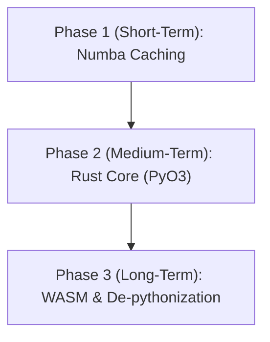

# Standalone Performance and De-pythonization Roadmap

> **Overtaken by events (2026-07-31). Read the rest of this document as the
> analysis that led to a decision, not as pending work.**
>
> **MolSysMT no longer uses Numba. It was rewritten in Rust for 1.0.** Verified
> against the installed package: zero `.py` files under `molsysmt/` reference
> `numba`, and it ships a compiled `_rust.abi3.so`.
>
> That means **Path B / Phase 2 has already happened**, years ahead of the
> v2.0.0 target this roadmap assigned it — and it happened in MolSysMT rather
> than as a separate `molsys_core` crate. The consequences for this document:
>
> | Section | Status |
> |---|---|
> | §1 "The Cold Start Problem" — the 3–5 s JIT freeze | **Gone.** The premise no longer exists. |
> | Path A (Numba cache / AOT) | **Moot.** There are no `@jit` decorators left to cache. |
> | Path B (Rust + PyO3) | **Done**, in MolSysMT itself. |
> | Path C (WASM / de-pythonization) | **Still open**, and now much closer: the Rust core it presupposed exists. Its own preconditions — API parity between the Python library and a WASM/JS surface, and a Tauri-class shell — are untouched. |
> | Phase 1 of the Recommended Roadmap | Withdrawn. |
>
> What is worth re-deriving rather than assumed: the standalone host's *actual*
> startup cost today. This document's numbers all measured JIT compilation. Any
> remaining startup latency now has a different cause — import cost, Qt WebEngine
> initialization, or first-load serialization — and none of it has been measured
> since the rewrite. **Do not quote the 3–5 seconds below as current.**
>
> Path C's evaluation stands and is the only part of this file still live.

This document outlines the strategic roadmap for addressing the JIT compilation latency ("cold start" problem) in the `molsysmt` / `molsysviewer` backend, particularly for non-programmer desktop environments. It analyzes immediate workarounds and long-term architectural transitions to Rust and WebAssembly (WASM).

---

## 1. Context & The "Cold Start" Problem

### The Current Architecture
`MolSysViewer` is built as a hybrid application:
- **Frontend**: A TypeScript/JavaScript layer (`viewer.js`) built on top of the high-performance WebGL2 molecular graphics engine, **Mol***.
- **Backend**: A Python library (`molsysviewer` / `molsysmt`) that manages molecular structures, topology representations, JIT-accelerated coordinate updates, and integrations.

### The Problem
When running the viewer—especially in standalone desktop hosts (such as the `PySide6` prototype)—the first execution of performance-critical Python algorithms (e.g., coordinate parsing, distance calculations, or topology selections) incurs a **3 to 5-second freeze**. 

This latency is caused by **Numba's Just-In-Time (JIT) compilation**. While JIT compilation provides near-native execution speed *after* the first run, the initial "cold start" creates a poor user experience (UX) for non-programmers, making the application feel unresponsive or frozen.

---

## 2. Technical Solutions: Analysis

We evaluate three main paths to solve this problem:

### Path A: JIT Caching and Ahead-Of-Time (AOT) Compilation (Short-Term)
Leverage Numba's built-in caching and compilation features without rewriting the Python codebase.

- **Option A1: Persistent JIT Caching**
  Add the `cache=True` parameter to all `@jit` and `@njit` decorators in `molsysmt`.
  - **How it works**: Numba compiles the function once, then writes the machine code to a local disk cache (e.g., inside `__pycache__`). Subsequent application launches load the precompiled binary instantly in milliseconds.
  - **Pros**: 
    - Extremely easy to implement (minimal code changes).
    - Preserves the existing pure-Python development workflow.
  - **Cons**:
    - The very first run after installation (or after package updates) still experiences the JIT lag.
    - Cache invalidation can occasionally occur if python versions or dependencies change.

- **Option A2: Ahead-Of-Time (AOT) Compilation**
  Use Numba's `numba.pycc` module to compile critical JIT functions into native shared libraries (`.so`, `.pyd`) during the package build/installation phase.
  - **How it works**: The package is distributed with pre-compiled C-extension modules.
  - **Pros**:
    - Completely eliminates JIT lag on the user's machine, even on the first run.
  - **Cons**:
    - Requires explicit type signatures for all compiled functions, reducing Python's dynamic flexibility.
    - Requires compiling separate binaries for every target OS and architecture (Windows, macOS Intel/M1/M2, Linux) during CI/CD.

---

### Path B: Migrating Performance-Critical Core to Rust (Medium-Term)
Re-implement the performance-sensitive computation engine (coordinate parsing, selection algebra, topology processing) in **Rust**, exposing it to Python via **PyO3** and **Maturin**.

- **How it works**: A compiled Rust library (`molsys_core`) is built and distributed as a binary wheel. Python interacts with it transparently as a standard compiled module.
- **Pros**:
  - **Zero JIT Latency**: Instantaneous startup with native execution speed.
  - **Memory Safety & Concurrency**: Rust's compiler guarantees memory safety and makes multi-threaded CPU-bound calculations (like trajectory parsing) highly efficient.
  - **Excellent Tooling**: `PyO3` and `Maturin` provide a seamless developer experience for building Python bindings.
- **Cons**:
  - Requires a developer learning curve (Rust is more complex than Python).
  - Requires building and shipping binary wheels for all target platforms in CI/CD.

---

### Path C: "De-pythonization" via WebAssembly & Frontend Delegation (Long-Term)
Compile the Rust core to **WebAssembly (WASM)** and run it directly in the JavaScript/TypeScript frontend, or delegate more responsibilities to the Mol\* engine.

- **How it works**:
  - **WASM compilation**: The same Rust core used by the Python library is compiled to WASM and loaded by `viewer.js` in the browser or webview.
  - **Frontend Delegation**: Use Mol\*'s highly optimized internal data structures for selections, measurements, and basic topology queries instead of querying the Python backend.
- **Pros**:
  - **Zero Python Dependency**: For the non-programmer desktop application, we can bypass Python entirely. The app becomes a pure web-shell (Electron/Tauri) that parses PDBs, manages selections, and plays trajectories locally at native speed via WASM.
  - **Single Frontend codebase**: A single `viewer.js` contains both the visualization and the computation engine, making it fully portable (Jupyter, standalone web, desktop app).
- **Cons**:
  - Significant architectural rewrite.
  - Requires maintaining parity between the Python API (for Jupyter scripting users) and the WASM/JS API.

---

## 3. Comparative Summary

| Metric | Path A: Numba Cache/AOT | Path B: Rust + PyO3 | Path C: Rust WASM / JS Delegation |
| :--- | :--- | :--- | :--- |
| **UX / JIT Latency** | Low/Medium (Lag on 1st run) | **Zero** (Instant) | **Zero** (Instant) |
| **Development Effort**| Very Low | Medium | High |
| **App Bundle Size** | Large (Requires Python + Numba) | Large (Requires Python) | **Extremely Small** (Zero Python runtime) |
| **WASM Portability** | No | No | **Yes** (Runs in any browser) |
| **Maintenance Risk** | Low | Low | Medium (API parity sync) |

---

## 4. Recommended Roadmap

To achieve a seamless desktop UX for non-programmers without stalling active development, the following phased roadmap is recommended:

### Phase 1: Pragmatic JIT Optimization (Target: v1.1.0)
1. **Enable JIT Cache**: Add `cache=True` to all `@jit` decorators in `molsysmt` and `molsysviewer`.
2. **Pre-warming / Loading Screen**: During the desktop app startup or when first loading a molecular system, run a silent "pre-warming" routine in a background thread while displaying a polished loading spinner (e.g., *"Optimizing calculations..."*). This prevents the UI from freezing.

### Phase 2: Core Migration to Rust (Target: v2.0.0)
1. **Isolate Compute Core**: Define a clear boundary for the heaviest computations (topology matching, selection parsing, XTC/DCD coordinate extraction).
2. **Implement `molsys_core` in Rust**: Write these components in Rust. Use `PyO3` to expose them as a high-performance Python package.
3. **Replace Numba**: Swap out Numba decorators in favor of the compiled Rust module, eliminating JIT compilation from the Python backend entirely.

### Phase 3: Pure Web/WASM Standalone App (Target: v3.0.0)
1. **Compile to WASM**: Compile the Rust `molsys_core` to WebAssembly.
2. **Ship a Zero-Python Desktop App**: Package the standalone desktop application (using Tauri or Electron) with the WASM module. Non-programmers can download a ~50MB app that runs entirely in-browser/in-webview with native performance, while Jupyter notebook users continue to use the Python library.
