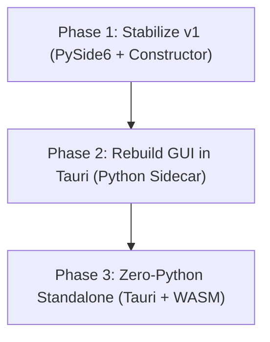

# Standalone Version 2 Evolution Plan: Desktop for Non-Programmers

This document outlines the architectural plan for the second version (v2) of the **MolSysViewer Standalone Application**. While Standalone v1 is designed as a developer-centric `PySide6` shell, Standalone v2 aims to deliver a native, high-performance, and zero-configuration desktop experience tailored specifically for **non-programmers** (biologists, chemists, and students who do not use the command line).

> **Amended 2026-07-31 — one of this document's main arguments no longer holds.**
>
> **MolSysMT was rewritten in Rust for 1.0 and no longer uses Numba** (verified:
> no `.py` file under `molsysmt/` references it, and it ships `_rust.abi3.so`).
> Every claim below about JIT compilation lag is therefore obsolete:
>
> - §1.2 point 1 — "a JIT compiler (Numba)" is no longer bundled;
> - Option 1 con — "still suffers from JIT compilation latency" is false;
> - Option 3 pro — "no Numba JIT lag" is no longer a *differentiator*, because
>   Option 1 does not have it either;
> - the comparison matrix row **Startup Time** is corrected in place below;
> - Phase 1 action 2, "Implement Numba JIT Caching", is withdrawn.
>
> **The rewrite moves Option 3 in both directions, and both must be said.**
>
> *Against it:* startup latency was the strongest argument for going to
> Rust/WASM, and the Rust half already happened inside MolSysMT — delivering that
> benefit **without** removing Python. What survives as a genuine advantage is
> installer size, installation reliability and a single frontend codebase: real,
> but a softer case than "instant versus a five-second freeze".
>
> *For it:* the **Development Cost** row is now too pessimistic. Option 3 was
> priced as a full Rust rewrite of the parsers, selections and topology matching.
> That rewrite is **done**. What remains is compiling an existing crate to a
> `wasm32` target and building the JS surface over it — still substantial, and
> still carrying the API-parity obligation, but no longer the same order of work.
>
> The remaining startup cost of Option 1 has **not been measured since the
> rewrite**. It is now import cost plus Qt WebEngine initialization, not
> compilation. Re-measure before this comparison is used to decide anything, in
> either direction.

---

## 1. Context & The Challenge of Standalone v1

### Standalone v1 (Current State)
The current v1 prototype ([standalone_qt](../molsysviewer/standalone_qt)) uses a monolithic **PySide6 (Qt) + QtWebEngine** architecture. It bundles the Python runtime, the scientific libraries (`molsysmt`, `numba`, `numpy`), and a Chromium-based web view into a single process.

### The Challenge for Non-Programmers
While v1 is a great bridge for developers, it has significant limitations when targeted at non-programmers:
1. **Installation Complexity**: Distributing a Python environment with compiled C/C++ extensions and a JIT compiler (Numba) is notoriously fragile. If a user's local C-runtime or graphics drivers differ, the app may fail to launch.
2. **Resource Footprint**: Bundling Python, Qt, and Chromium results in a massive installer size (>300MB) and high memory consumption, which is inefficient for a visualization tool.
3. **UI/UX Styling Constraints**: Implementing modern, fluid, and premium desktop interfaces (with acrylic/blur effects, dark/light mode synchronization, custom window frames, and native drag-and-drop) is verbose and platform-dependent in Qt compared to modern web technologies.
4. **Window Management**: Support for advanced multi-display workflows (such as our three-window layout: Canvas + Panel + Popup) requires manual interception of Qt WebEngine's window creation signals and custom IPC mapping in Python.

---

## 2. Proposed Architectures for Standalone v2

To transition to a consumer-grade desktop application, we evaluate three potential architectures:

### Option 1: Evolved PySide6 (Monolithic Native GUI)
Evolve the current v1 prototype by building a native Qt (Widgets/QML) shell around the WebGL canvas, using **Conda Constructor** for packaging.

- **Pros**:
  - Unified codebase: Everything is written in Python and TypeScript.
  - Direct in-process access to `molsysmt` and `topomt` (no local network sockets required).
- **Cons**:
  - Huge installer size and memory footprint.
  - Styling QML/Widgets to match modern macOS/Windows design aesthetics is extremely time-consuming.
  - Still suffers from JIT compilation latency unless AOT/Caching is aggressively managed.

### Option 2: Tauri/Electron + Python Sidecar (Hybrid App)
Build the entire desktop user interface in HTML/CSS/TypeScript (using **Tauri** or **Electron**). When the app launches, it spawns a hidden, local Python microservice (e.g., using `FastAPI` or `Flask`) that wraps `molsysmt`.

- **Pros**:
  - **Premium UI/UX**: Leverage modern web frameworks (React, Vue, Tailwind) and Tauri's native OS integrations for stunning visual aesthetics.
  - **Perfect Multi-Window Support**: Web-native window management makes dragging the toolbar or the trajectory player to a second screen incredibly simple.
- **Cons**:
  - **Double Runtime Overhead**: The app must run both the frontend shell and a background Python process.
  - **Security & Network Risks**: Running a local web server can trigger OS firewall warnings, which confuses non-technical users.
  - **Packaging Complexity**: Bundling a Python environment as a "sidecar" inside a Tauri/Electron installer remains heavy and prone to environment-recipe failures.

### Option 3: Tauri + WebAssembly (Pure Web/WASM) — *The Target Vision*
Re-write the core computational engine of `molsysmt` (parsers, selections, topology matching) in **Rust**, compile it to **WebAssembly (WASM)**, and run it directly inside a **Tauri** desktop shell. **Python is completely removed from the desktop application.**

- **Pros**:
  - **Zero Python Dependency**: No Python runtime, no Conda, no Numba JIT lag.
  - **Ultra-Lightweight**: The installer size shrinks to **~50MB**, and the app launches instantly.
  - **Maximum Security**: Runs entirely within the secure WebAssembly/browser sandbox (no local web servers or open ports).
  - **Unified Frontend**: The exact same WASM module runs in the Jupyter widget (client-side), the static HTML exports, and the desktop app.
- **Cons**:
  - High initial development effort (requires migrating performance-critical parts of `molsysmt` to Rust).
  - Requires maintaining API and feature parity between the Python scripting library and the WASM desktop library.

---

## 3. Comparison Matrix

| Feature | Option 1: PySide6 Evolved | Option 2: Tauri + Python Sidecar | Option 3: Tauri + WASM (Target) |
| :--- | :--- | :--- | :--- |
| **Installer Size** | ~350 MB | ~300 MB | **~50 MB** |
| **Startup Time** | Python boot + Qt WebEngine init — **unmeasured since the Rust rewrite**; the "3-5s JIT lag" recorded here no longer applies | Medium (Python boot time) | **Instant** (<1s) |
| **UI Aesthetics** | Traditional Desktop | Modern / Premium | **Modern / Premium** |
| **Installation Reliability**| Medium (Conda-dependent) | Medium (Sidecar-dependent) | **Very High** (Self-contained) |
| **Development Cost** | Low | Medium | ~~High (Rust rewrite)~~ → **Medium**: the Rust core exists in MolSysMT; what remains is a `wasm32` target plus the JS surface and API parity |

---

## 4. Recommended Evolution Roadmap

To transition from the current developer prototype to the ultimate non-programmer application, we propose a three-phase roadmap:

### Phase 1: Stabilize & Package Standalone v1 (Short-Term)
* **Goal**: Deliver a working desktop app to early testers using the current codebase.
* **Actions**:
  1. Implement the `createWindow` handler in `standalone_qt` to support the three-window popout layout.
  2. ~~Implement Numba JIT Caching to hide compilation lag.~~ **Withdrawn 2026-07-31:** MolSysMT is Rust; there is nothing left to cache. Replace with a measurement of what startup actually costs now.
  3. Use **Conda Constructor** to generate a single-click installer (`.exe`/`.pkg`) containing the PySide6 app.

### Phase 2: Decouple the UI via Tauri (Medium-Term)
* **Goal**: Modernize the UI/UX and separate the frontend from the Python process.
* **Actions**:
  1. Rebuild the desktop application shell using **Tauri** (Rust backend, HTML/TS frontend).
  2. Package a minimal Python runtime containing `molsysmt` as a Tauri **Sidecar**.
  3. Establish communication between the Tauri frontend and the Python sidecar via a local WebSocket/REST API.
  4. Implement native multi-window dragging, light/dark mode sync, and drag-and-drop file loading.

### Phase 3: Pure WebAssembly V2 (Long-Term)
* **Goal**: Eliminate the Python sidecar entirely, achieving a lightweight, instant-on desktop app.
* **Actions**:
  1. Migrate the core file parsers, topology matching, and selection algebra of `molsysmt` to a shared **Rust** crate.
  2. Compile the Rust crate to **WebAssembly (WASM)**.
  3. Integrate the WASM module directly into the Tauri frontend.
  4. Remove the Python sidecar from the installer, resulting in the final, ultra-lightweight Standalone v2.
